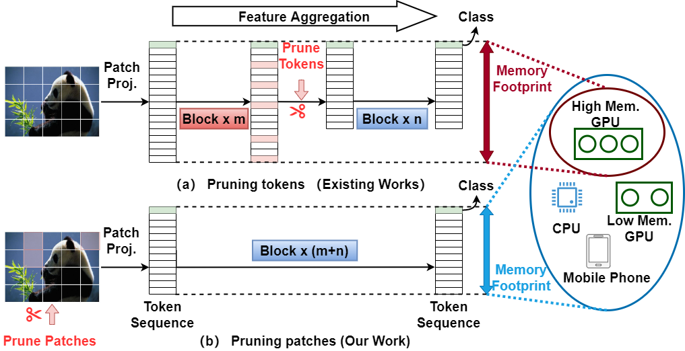

# Neighbor patches merging reduces spatial redundancy to accelerate Vision Transformer
Official PyTorch implementation of Neighbor patches merging reduces spatial redundancy to accelerate vision transformer | [Paper](https://www.sciencedirect.com/science/article/pii/S0925231224015042)
## Overview

<p align="center">

</p>
We introduce a simple, fast, and training-free token pruning method that reduces the memory footprint of the Vision Transformer.

## Installation

Firstly, install the PyTorch following the tutorial on the [official website](https://pytorch.org/) 

Secondly, run the following scripts
```bash
pip install -r requirements.txt
```

## Scripts

### Test the accuracy on ImageNet-1K
```bash
bash val.sh
```
### Test the inference time and memory footprints 
```bash
bash ben.sh
```

## License
This project is released under the MIT license. Please see the [LICENSE](LICENSE) file for more information.

## Citation

```
@article{JIANG2025128733,
title = {Neighbor patches merging reduces spatial redundancy to accelerate vision transformer},
journal = {Neurocomputing},
volume = {613},
pages = {128733},
year = {2025},
issn = {0925-2312},
doi = {https://doi.org/10.1016/j.neucom.2024.128733},
url = {https://www.sciencedirect.com/science/article/pii/S0925231224015042},
author = {Kai Jiang and Peng Peng and Youzao Lian and Weihui Shao and Weisheng Xu}
}
```